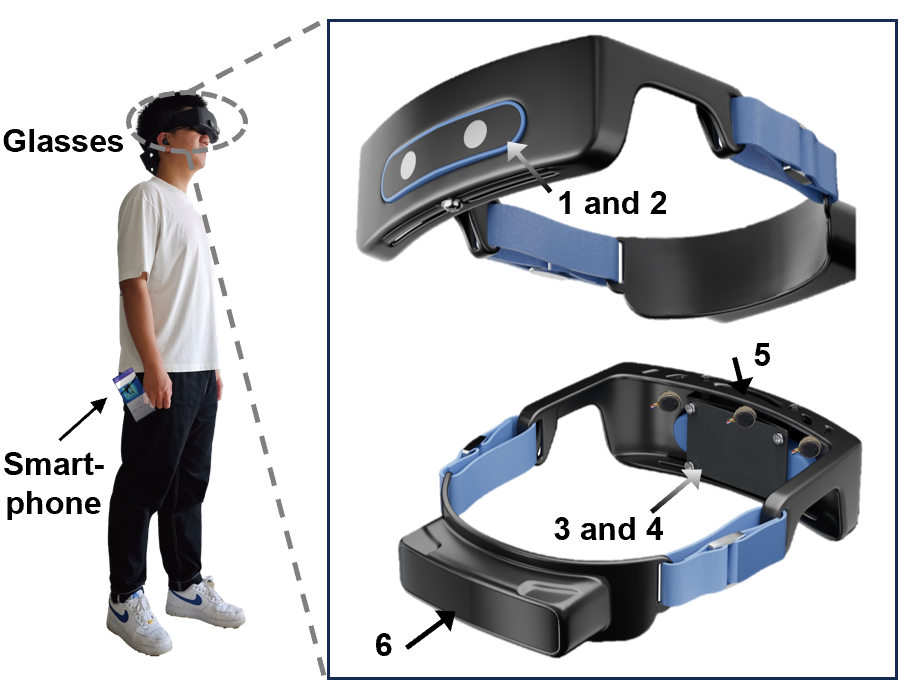

# WOAD: A Wearable Obstacle Avoidance Device for Visually Impaired Individuals with Cross-Modal Learning

## Abstract:

It is challenging for wearable obstacle avoidance devices to simultaneously meet practical demands of high reliability, rapid response, long-lasting duration, and usable design. Here we report a wearable obstacle avoidance device, comprising a set of self-developed glasses (weighing $\sim 400$ grams, including an $\sim 80$ grams battery) and a common smartphone. Specifically, the glasses collect the multi-modal data for comprehensive environmental perception, including video and depth modalities, and implement a depth-aided video compression module. This module not only adaptively compresses video data to reduce transmission delay to the smartphone, but also operates on a customized FPGA board featuring a multi float-point vector unit streaming processing architecture, thereby facilitating responsive and energy-efficient obstacle detection. Additionally, we design a cross-modal obstacle detection module on the smartphone, which ensures reliable detection and provides user-friendly auditory and tactile alerts by utilizing cross-modal learning based on modal correlations. Multiple indoor and outdoor experimental results demonstrate $100\%$ collision avoidance rates, delay of less than $320ms$, and duration of approximately 11 hours. 



This repository contains the source codes and data for our paper:

## 1. Data collection and pre-processing

You can access all the data and source codes from [Google Drive Link](https://drive.google.com/file/d/1wmSLaWwfrAhYCl45vA9duIuWpEkHk4q8/view?usp=sharing)

### Environment
* Windows 11
* Gcc 9.4.0
* G++ 9.4.0
* Opencv_imgproc440.dll
* SonixCamera.dll
* Csreconstruction.dll
* Libsynexens3.dll

The installation time will take no longer than 60 minutes on a "normal" desktop computer with good Internet conditions.

### Device and Driver
* Synexens RGB-TOF multi-modal sensor [CS30](https://support.tofsensors.com/product/CS30.html)
* cs30-driver v.11

### Demo
* Run the `save_depth_ir_rgb.exe` in `bin/x64`.

The expected output is the depth/ir/rgb data in `bin/x64/testxxxxxxxxxx`.
You can access the demo data from [Google Drive Link](https://drive.google.com/file/d/16nxM4GkWZGpKtzeJkYbadz4rSrCrG172/view?usp=sharing)

The expected run time of the demo will take no longer than 2 minutes on a "normal" desktop computer with the cs30 device.


## 2. RL for adaptive video compression 

You can access all the data and source codes from [Google Drive Link](https://drive.google.com/file/d/11F03TIDk7saP8CxHhtUQ2NUzwRudHL46/view?usp=sharing)

### Environment

* Python 3.8  
* Torch 1.13.1  
* D3rlpy 1.1.1

1. Run `pip install -r requirements.txt` to install all dependencies required in your machine.

2. Import PyTorch with the correct CUDA version.

The installation time will take no longer than 20 minutes on a "normal" desktop computer with good Internet conditions.

### Data availability

All the necessary data for the demo is included in the `./RL_data folder`.

Download the data form [Google Drive Link](https://drive.google.com/file/d/100_sZQyzOolvUEu6isxiwMHsYrxk5sC5/view?usp=sharing) and put it into the `./RL_data folder`.

### Demo
* Run `python train_RL.py` to get policy model without cerebellar reward.
* Run `python creat_MDPDataset_cerebellar_reward.py` to get dataset with cerebellar reward.
* Run `python train_cerebellar_RL.py` to get policy model with cerebellar reward.
* Run `python save_DSAC_onnx_model.py` to save poliicy model.

In the end, you will obtain `policy_cerebellar.onnx`, which will be deployed on the WOAD as C++ code for pre-processing.

The expected run time of the demo will take no longer than 10 minutes on a "normal" desktop computer.


## 3. FPGA deployment 

You can access all the data and source codes from [Google Drive Link](https://drive.google.com/file/d/1PExD1QZmMm3K0I-1pPuamR4yuenDzLP_/view?usp=sharing)

### Environment

* Vscode 1.91.1
* Vscode extension Digital-IDE 0.2.6
* Vivado 2018.3

The installation time will take no longer than 30 minutes on a "normal" desktop computer with good Internet conditions.

### Device
* FPGA/zynq [xc7a35tftg256](https://www.amd.com/zh-cn/products/adaptive-socs-and-fpgas/fpga/artix-7.html)

### File Structure

```
📦user
 ┣ 📂data
 ┃ ┣ 📂in --------------- Model parameter files
 ┃ ┃ ┣ 📂coe
 ┃ ┃ ┣ 📂fp16
 ┃ ┃ ┗ 📂fp32
 ┃ ┗ 📜map.xdc ---------- Constraints file
 ┣ 📂ip ----------------- Xilinx IP files
 ┃ ┣ 📂clk_25m 
 ┣ 📂sim ---------------- Simulation files
 ┃ ┣ 📂math
 ┃ ┣ 📂RL
 ┃ ┃ ┣ 📂out
 ┃ ┣ 📂VIP
 ┃ ┃ ┣ 📂data
 ┃ ┗ 📜testbench.v
 ┗ 📂src ---------------- Source files
 ┃ ┣ 📂driver
 ┃ ┃ ┗ 📂uart
 ┃ ┣ 📂process
 ┃ ┃ ┗ 📂RL
 ┃ ┃ ┃ ┣ 📂AXI_Lite
 ┃ ┃ ┃ ┣ 📂ROM
 ┃ ┣ 📂system
 ┃ ┣ 📂utils 
 ┃ ┃ ┣ 📂math
 ┃ ┃ ┃ ┣ 📂comb
 ┃ ┃ ┃ ┣ 📂timing
 ┃ ┗ 📜RL_top.v --------- top design
```
### Demo

[Plugin Tutorial](https://sterben.nitcloud.cn/)
```
// property.json
{
	"TOOL_CHAIN": "xilinx",
	"PRJ_NAME": {
		"FPGA": "Tactical-helmet"
	},
	"SOC_MODE": {
		"soc": "none"
	},
	"enableShowlog": false,
	"Device": "xc7z010clg400-1"
}
```
* `launch` ----- to start the whole project
* `build` ------ to build the whole project and finally output the bit stream file
* `program` ---- download the bitstream file to the FPGA/zynq board

## 4. Cross-Modal obstacle detection 

You can access all the data and source codes from [Google Drive Link](https://drive.google.com/file/d/1tJpmOu5DCxapU0XcoKPt76LHkW18s5xB/view?usp=sharing)

### Environment

* Python 3.8
* Torch 1.13.1

1. Run `pip install -r requirements.txt` to install all dependencies required in your machine.

2. Import PyTorch with the correct CUDA version.

The installation time will take no longer than 20 minutes on a "normal" desktop computer with good Internet conditions.

### Data availability

The training/validation/test datasets can be found in the [Google Drive Link](https://drive.google.com/file/d/1B9atHC74YXSZ89GcjtqVp_gJUezdxpPE/view?usp=sharing) and put them into the `./`.

### Demo
* Run `python train.py --data data/stairscoco_nc_4/6/8/10.yaml`.

After the training is complete, you can find the optimal weights in `/runs/train/best.pt`, which will be deployed on the mobile device.

* Run `python val.py --data data/stairscoco_nc_4/6/8/10.yaml` to get dataset with cerebellar reward.

You can determine the performance of the weights on the test set.

The installation time will take no longer than 120 minutes on a "normal" desktop computer with GPU device.

## 5. Smartphone deployment
You can access all the data and source codes from [Google Drive Link](https://drive.google.com/file/d/1Kava0aKGvZWK7KlZPpPcejlNSpcZgbpT/view?usp=sharing).

### Environment
* Python 3.8 
* OpenCV-java 4.5.4
* Android pytorch_android_lite 1.10.0
* Pytorch_android_torchvision_lite 1.10.0
* TensorFlow Java 2.0
* Android Studio 4.0.1 or later

1. Prepare the external library OpenCV-Java

    1.1 Download OpenCV Android SDK
    Firstly, you need to download the OpenCV SDK for Android from the OpenCV [official website].(https://opencv.org/releases/) In our project, we use version 4.5.4.
   
    1.2 Import OpenCV library into Android Studio project
    Then, unzip the downloaded OpenCV Android SDK file. Then open Android Studio, select `"File" ->"New" ->"Import Module"`. Afterwards, select the Java folder in the decompressed OpenCV Android SDK directory and click "Finish" to import.

    1.3 Configure project dependencies
   Add dependencies to the OpenCV library in the build.gradle file of the project:

    ```
    dependencies {
    implementation project(':opencv')
    }
    ```
    Add dependencies to the OpenCV library in the build.gradle file of the :app:
    ```
    implementation project(path: ':OpenQCV')
    ```

2. Build with Android Studio

    Start Android Studio, then open the project located in `WOAD-Moblie-ObjectDetection`. Note the app's `build.gradle` file has the following lines:

    ```
    implementation 'org.pytorch:pytorch_android_lite:1.10.0'
    implementation 'org.pytorch:pytorch_android_torchvision_lite:1.10.0'
    implementation 'org.tensorflow:tensorflow-lite:2.4.0'
    implementation 'org.tensorflow:tensorflow-lite-gpu:2.4.0'
    ```
    
The installation time will take no longer than 60 minutes on a "normal" desktop computer and Android smart phone.

### Demo
Select an Android emulator or device to run the app. You can go through the included example test images to see the detection results.

If you have a WOAD hardware device, after enabling the hardware device client, you can select the SelectButton on the interface to start the phone as a server for streaming testing of the device.

The important code is located in the following positions:

```
WOAD-Moblie-ObjectDetection\app\src\main\java\org\pytorch\demo\objectdetection\MainActivity.java
WOAD-Moblie-ObjectDetection\app\src\main\java\org\tensorflow\lite\examples\detection\tflite\YoloV5Classifier.java
WOAD-Moblie-ObjectDetection\app\src\main\java\org\tensorflow\lite\examples\detection\tflite\YoloV5ClassifierDetect.java
```
## License
Please see the `LICENSE.txt` for further details.
